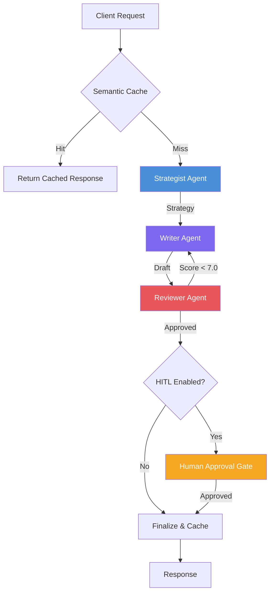

# Agentic Content Pipeline

[](https://github.com/Maanik23/agentic-content-pipeline/actions)
[](https://www.python.org/downloads/)
[](LICENSE)

A production-ready multi-agent content pipeline built with **LangGraph**, **FastAPI**, and **Redis semantic caching**. Three specialized AI agents collaborate through a stateful graph to strategize, write, and review content — with automatic revision loops and optional human-in-the-loop approval.

## Architecture



## Agents

| Agent | Role | Output |
|---|---|---|
| **Strategist** | Analyses brand context and topic to define audience, messaging, tone | `Strategy` (structured) |
| **Writer** | Generates content matching the strategy; incorporates revision feedback | Raw content string |
| **Reviewer** | Scores draft 1-10 on accuracy, tone, clarity; auto-approves above threshold | `ReviewResult` (structured) |

The reviewer → writer loop runs up to 3 times (configurable), then force-accepts the best draft.

## Features

- **Multi-Agent Pipeline** — Strategist → Writer → Reviewer with automatic revision loop
- **Semantic Caching** — Redis-backed cosine similarity cache that deduplicates LLM calls for equivalent queries
- **Human-in-the-Loop** — Optional interrupt gate using LangGraph checkpoints for human approval before publish
- **SSE Streaming** — Real-time Server-Sent Events for pipeline progress
- **Multi-Provider** — Swap between OpenAI, Google Gemini, and Anthropic via a single env var
- **Production-Ready** — Docker Compose, GitHub Actions CI, structured types throughout

## Quick Start

```bash
git clone https://github.com/Maanik23/agentic-content-pipeline.git
cd agentic-content-pipeline
pip install -e ".[dev]"

cp .env.example .env
# Edit .env — add your LLM API key

uvicorn pipeline.api.app:create_app --factory --reload
```

**With Docker:**

```bash
cp .env.example .env
docker compose up
```

## API

```bash
# Generate content (sync)
curl -X POST http://localhost:8000/generate \
  -H "Content-Type: application/json" \
  -d '{
    "topic": "AI Agents in Production",
    "brand_context": "Enterprise AI consultancy"
  }'

# Stream pipeline events (SSE)
curl -N -X POST http://localhost:8000/generate/stream \
  -H "Content-Type: application/json" \
  -d '{"topic": "AI Agents in Production"}'
```

## Programmatic Usage

```python
import asyncio
from pipeline import Settings, create_pipeline

async def main():
    pipeline = create_pipeline(Settings(llm_provider="openai"))
    result = await pipeline.ainvoke({
        "topic": "How AI Agents Are Changing Marketing",
        "brand_context": "AI consultancy for mid-market companies",
        "revision_count": 0,
        "trace": [],
    })
    print(result["final_content"])

asyncio.run(main())
```

## Configuration

All settings are configurable via environment variables (prefix: `PIPELINE_`):

| Variable | Default | Description |
|---|---|---|
| `PIPELINE_LLM_PROVIDER` | `openai` | LLM provider (`openai` / `google` / `anthropic`) |
| `PIPELINE_LLM_MODEL` | `gpt-4o` | Model identifier |
| `PIPELINE_LLM_API_KEY` | — | API key for the chosen provider |
| `PIPELINE_REDIS_URL` | `redis://localhost:6379/0` | Redis connection string |
| `PIPELINE_CACHE_SIMILARITY_THRESHOLD` | `0.92` | Cosine similarity threshold for cache hits |
| `PIPELINE_MAX_REVISIONS` | `3` | Maximum writer → reviewer revision loops |
| `PIPELINE_REVIEW_SCORE_THRESHOLD` | `7.0` | Minimum score (1-10) for auto-approval |
| `PIPELINE_ENABLE_HITL` | `false` | Enable human-in-the-loop approval gate |

## Development

```bash
pip install -e ".[dev]"

# Run tests
pytest --cov=pipeline

# Lint & type check
ruff check src/ tests/
mypy src/pipeline/ --ignore-missing-imports
```

## Tech Stack

- **[LangGraph](https://github.com/langchain-ai/langgraph)** — Stateful agent orchestration as a compiled graph
- **[FastAPI](https://fastapi.tiangolo.com/)** — Async API with SSE streaming
- **[Redis](https://redis.io/)** — Semantic caching layer with embedding similarity
- **[Pydantic v2](https://docs.pydantic.dev/)** — Structured LLM outputs and type-safe configuration

## License

[MIT](LICENSE)
